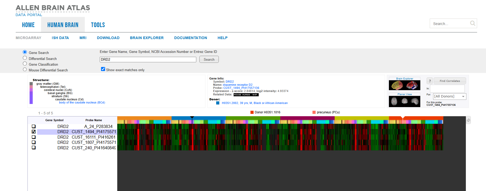
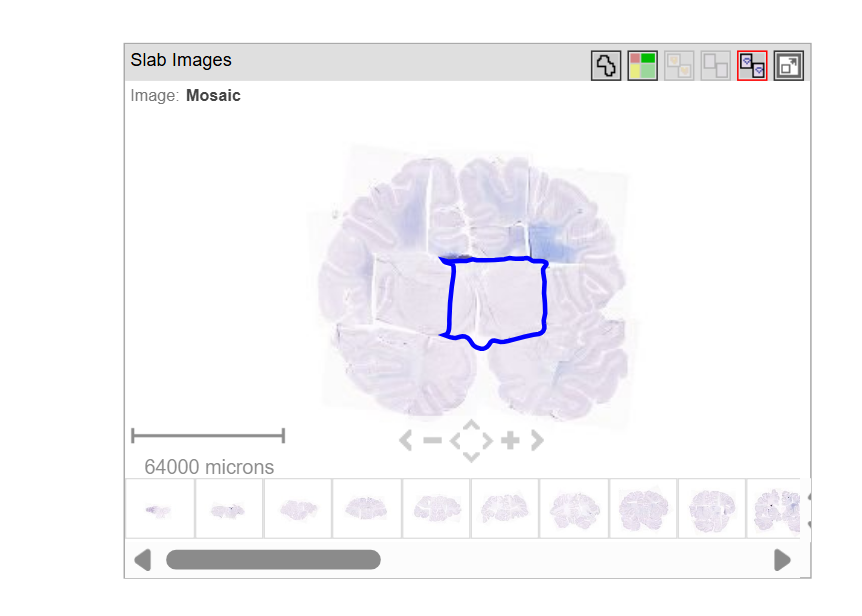
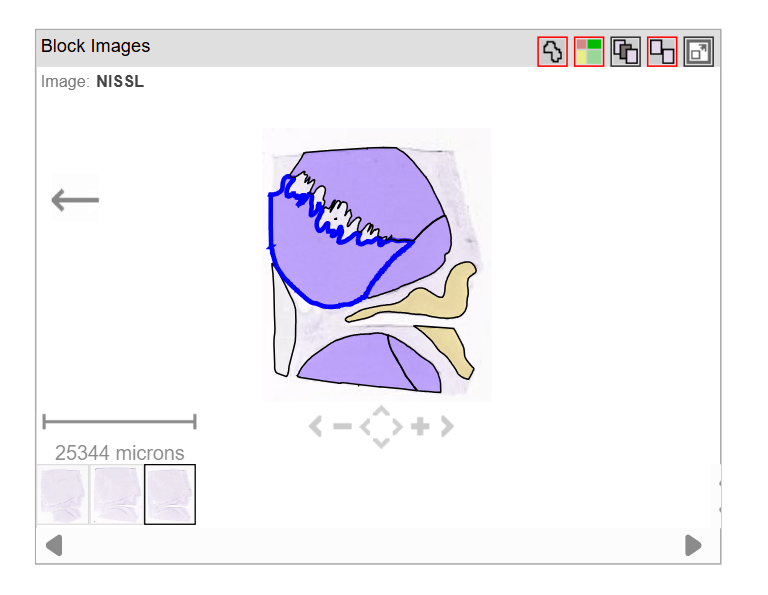

# Spatial Gene expression mapping of Dopamine receptor D2 (DRD2) across the human brain 

## Executive Summary
In this project, I investigated how the brain maps out its genetic blueprints for movement. I observed **Dopamine receptor D2 (*DRD2*)** across the entire human brain using high-resolution molecular data. I took microarray transcriptome dataset from the **Allen Human Brain Atlas**
The aim of this analysis is to evaluate whether regional genetic activity correlates with the known functional pathways of the motor system. Since Dopamine is involved in controlling physical movement, the mRNA expression is expected to show regional enrichment in the brain's internal motor hubs (Basal ganglia) such as caudate nucleus and putamen compared to Neocortical control layers (The cerebral cortex). Therefore, I analyzed the raw mRNA expression levels on the atlas.

---
## Scientific background and hypothesis

* **Biological context:** The dopamine D2 receptor (DRD2) is a crucial G protein-coupled receptor (GPCR) encoded by the DRD2 gene on chromosome 11. It is one of the most abundant dopamine receptors in the central nervous system, particularly concentrated in the basal ganglia, nucleus accumbens, and prefrontal cortex. Unlike D1-like receptors which excite neurons, the D2 receptor is inhibitory. It plays a major role in central nervous system for inhibiting unwanted motor actions and modulating reward-based learning. 
* **Hypothesis:** Because DRD2 is heavily involved in gating the motor signals, I hypothize that the raw expression data will reveal significant structural enrichment (high positive z-scores) inside the basal ganglia specifically the head and tail of he caudate nucleus. whereas, expression should be zero or negative (z-scores) in the neocortical regions like the cerebral cortex.
  
---
## Methodology & Data Sources
* **Data Source:** [Allen Human Brain Atlas] *(https://atlas.brain-map.org/)* (Microarray Transcriptomic Data).
* **Data Visualization Method:** Data extraction and regional visualization were performed using the interactive graphic user interface (GUI) of the Allen Human Brain Atlas Web Interface.
* **Target Gene:** *DRD2* (Entrez Gene ID: 1813)
* **Selected probe:** CUST_1494_PI417557136
* **Evaluated Regions:** Striatal Structures (Head and Tail of the Caudate Nucleus, Putamen) and Neocortical Controls (Cerebral Cortex).
---

## Neuroanatomical Visualizations

### Figure 1: Whole-Brain DRD2 Expression Heatmap

*Fig 1: Complete microarray matrix view from the Allen Human Brain Atlas interface tracking DRD2 expression profiles across human donor tissue.*

### Figure 2: Anatomical Localization of DRD2 mRNA Transcripts

| Macro View: Whole Brain Slice |
|  
| *Figure 2A: Whole brain slice showing where the striatum tissue block was sampled.* |

---

| Micro View: Caudate Head Detail |
 |
| *Figure 2B: Zoomed-in tissue section highlighting the caudate head boundary.* |
